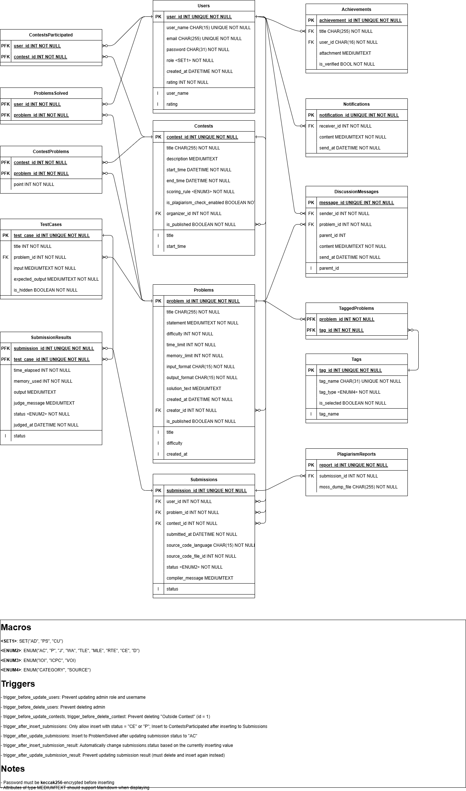

# Hướng dẫn sử dụng Online Judge Database

[TOC]

## Schema

Tên CSDL: OJDB.

Lược đồ quan hệ:



### Online hosting MySQL server

Hiện chưa có

### Cài đặt Schema (local)

Chạy `mysql` để vào MySQL, sau đó truy vấn

```sql
SOURCE ./src/services/init.sql
```

Để có dữ liệu mẫu, chạy tiếp truy vấn

```sql
SOURCE ./src/services/sampledata.sql
```

## Database API

Tất cả hàm và truy vấn trên dữ liệu được thực hiện thông qua đối tượng `db` thuộc lớp `Database`. Để sử dụng đối tượng này, cần có một file `.env` tại repo root directory có dạng

```
MYSQL_HOST="host"
MYSQL_USER="user"
MYSQL_PASSWORD="password"
MYSQL_DATABASE="ojdb"
```

### Constructor

```ts
constructor(
    __host: string,
    __user: string,
    __password: string,
    __database: string,
  )
```

Khởi tạo đối tượng thuộc lớp `Database`, trong đó mở kết nối tới database server. Kết nối được tạo ra là một connection pool kích thước bằng 10, sử dụng framework `mysql2`.

#### Tham số

- `__host`: Database host
- `__user`: Database user
- `__password`: Mật khẩu cho user
- `__database`: Tên database

#### Nhận xét

Khi import và gọi đối tượng `db`, nó đã được khởi tạo sẵn bằng hàm này với các tham số là các giá trị lưu trong `.env`.

### Hàm `queryAddProblem`

```ts
async queryAddProblem(
    title: string,
    statement: string,
    difficulty: number,
    timeLimit: number,
    memoryLimit: number,
    inputFormat: string | null,
    outputFormat: string | null,
    solutionText: string | null,
    creatorId: number,
    isPublished: boolean | null = false,
  ): Promise<boolean>
```

Thêm một bài toán vào CSDL.

#### Tham số

- `title`: Tên của bài toán
- `statement`: Đề bài và các miêu tả khác của bài toán
- `difficulty`: Một số nguyên mô tả độ khó của bài toán
- `timeLimit`: Giới hạn thời gian cho các lần nộp bài, tính bằng millisecond. Khi nộp bài, nếu bài nộp có thời gian chạy một test vượt quá giá trị này thì trạng thái kết quả sẽ là `TLE` (Time Limit Exceeded)
- `memoryLimit`: Giới hạn bộ nhớ cho các lần nộp bài, tính bằng kilobyte. Khi nộp bài, nếu bài nộp có bộ nhớ sử dụng để chạy một test vượt quá giá trị này thì trạng thái kết quả sẽ là `MLE` (Memory Limit Exceeded)
- `inputFormat`: Một xâu miêu tả cách mà code của người dùng nhận dữ liệu, từ màn hình console (stdin) hay từ một file input. Để là `null` để sử dụng input từ màn hình console, hoặc để là tên file nếu muốn input từ file đó.
- `outputFormat`: Một xâu miêu tả cách mà code của người dùng xuất dữ liệu ra, ra màn hình console (stdout) hay ra một file input. Để là `null` để sử dụng input từ màn hình console, hoặc để là tên file nếu muốn input từ file đó.
- `solutionText`: Một xâu miêu tả lời giải cho bài toán. Lời giải này có thể được viết dưới dạng Markdown. Có thể để `null` nếu không có lời giải
- `creatorId`: `userId` của người tạo bài tập này
- `isPublished`: Giá trị boolean cho biết bài toán này đã được hoàn thiện để đăng lên chưa (dùng cho tính năng Save Draft). Để là `null` hoặc bỏ qua tham số này sẽ ngầm định `isPublished = 0`.

#### Giá trị trả về

Một `Promise`, khi hoàn thành sẽ trả về `true` nếu thành công. Nếu có lỗi, hàm này sẽ ném lại lỗi đó.

#### Nhận xét

Sử dụng hàm này để thêm một bài tập vào CSDL, chẳng hạn:

````ts
db.queryAddProblem(
        "A cộng B",
        'Cho $2$ số nguyên $A$ và $B$. Hãy tính $A + B$.

## Input

Gồm $1$ dòng chứa $2$ số nguyên $A$ và $B$ $(1\\leq A\\leq B \\leq 1000)$, cách nhau bởi $1$ dấu cách.

## Output

Ghi ra tổng $A + B$.

## Sample input

```
3 4
```

## Sample output

```
7
```',
        800,
        1000,
        512,
        null,
        null,
        '```
#include <iostream>

using namespace std;

int main() {
    int a, b;
    cin >> a >> b;
    cout << a + b;
    return 0;
}
```'
````

sẽ cho ra một bài toán có đề bài là "A cộng B", nhận dữ liệu từ màn hình console, xuất ra màn hình console, độ khó là 800, giới hạn thời gian 1s, giới hạn bộ nhớ 512KB, và có đề bài và lời giải trong code (thử copy phần trên ra Markdown để xem chi tiết).

Về ID của bài toán mới, nó sẽ được tự tính thông qua MySQL `AUTO_INCREMENT`.

### Hàm `queryInsertProblem`

```ts
async queryEditProblemAttr(
    problemId: number,
    title: string | null = null,
    statement: string | null = null,
    difficulty: number | null = null,
    timeLimit: number | null = null,
    memoryLimit: number | null = null,
    inputFormat: string | null = null,
    outputFormat: string | null = null,
    solutionText: string | null = null,
    creatorId: number | null = null,
    isPublished: boolean | null = null,
  ): Promise<boolean>
```

Sửa một bài tập đang có trong CSDL, biết trước `problemId` của bài tập và một số tham số khác.

#### Tham số

- `problemId`: ID của bài tập trong cơ sở dữ liệu. Lấy giá trị này thông qua [`queryFindProblems`](#hàm-queryfindproblems)
- Các tham số còn lại: Xem [`queryAddProblem`](#hàm-queryaddproblem). Đặt là `null` để giữ nguyên giá trị đã có

#### Giá trị trả về

Một `Promise`, khi hoàn thành sẽ trả về `true` nếu thành công. Nếu có lỗi, hàm này sẽ ném lại lỗi đó.

#### Nhận xét

Xem [`queryAddProblem`](#hàm-queryaddproblem)

### Hàm `queryDeleteProblem`

```ts
async queryDeleteProblem(problemId: number): Promise<boolean>
```

Xoá một bài tập với ID cho trước đã có trong CSDL.

#### Tham số

- `problemId`: ID của bài tập trong cơ sở dữ liệu. Lấy giá trị này thông qua [`queryFindProblems`](#hàm-queryfindproblems)

#### Giá trị trả về

Một `Promise`, khi hoàn thành sẽ trả về `true` nếu thành công. Nếu có lỗi, hàm này sẽ ném lại lỗi đó.

#### Nhận xét

Nếu giá trị này không xuất hiện trong CSDL, không có gì xảy ra cả và hàm vẫn trả về `true` (do sử dụng `DELETE ... FROM ...`). Nếu xoá thành công, các bộ giá trị mang khoá ngoài tham chiếu đến giá trị này sẽ bị xoá (`ON DELETE CASCADE`).

### Hàm `queryGetProblemById`

```ts
async queryGetProblemById(problemId: number): Promise<string>
```

Trả về tất cả thông tin có trong CSDL cho một bài tập với ID của bài tập đó.

#### Tham số

- `problemId`: ID của bài tập trong cơ sở dữ liệu. Lấy giá trị này thông qua [`queryFindProblems`](#hàm-queryfindproblems)

#### Giá trị trả về

Một `Promise`, khi hoàn thành sẽ trả về một xâu có dạng JSON chứa tất cả các entry có trong CSDL nếu thành công. Nếu có lỗi, hàm này sẽ ném lại lỗi đó.

#### Nhận xét

### Hàm `queryFindProblems`

```ts
async queryFindProblems(
    problemId: number | null = null,
    title: string | null = null,
    difficultyLow: number | null = null,
    difficultyHigh: number | null = null,
    createdAtLow: string | null = null,
    createdAtHigh: string | null = null,
    creatorId: number | null = null,
    isPublished: boolean | null = null,
    limitRangeStart: number = 0,
    limitRangeSize: number = 50,
  ): Promise<string>
```

Lấy một số thông tin của một bài tập trong CSDL, dựa vào một số điều kiện cho trước. Kết quả được sắp xếp theo thời gian tạo của bài tập, từ mới đến cũ.

#### Tham số

- `problemId`: ID của bài toán. Để `null` hoặc bỏ qua để không sử dụng.
- `title`: Tên của bài toán. Để `null` hoặc bỏ qua để không sử dụng. Nếu khác `null`, kết quả trả về sẽ là một bài toán chứa một trong các từ có trong `title` (tìm bằng Full Text Search) hoặc có tiền tố là `title`.
- `difficultyLow`: Cận dưới độ khó của bài toán. Để `null` hoặc bỏ qua để sử dụng giá trị `difficultyLow = 0`
- `difficultyHigh`: Cận trên độ khó của bài toán. Để `null` hoặc bỏ qua để sử dụng giá trị `difficultyHigh = 4000`
- `createdAtLow`: Cận dưới thời gian tạo bài toán, theo format `DATETIME` của MySQL `yyyy-mm-dd hh:mm:ss`. Để `null` hoặc bỏ qua để sử dụng giá trị `createdAtLow = 2000-01-01 00:00:00`
- `createdAtHigh`: Cận trên thời gian tạo bài toán, theo format `DATETIME` của MySQL `yyyy-mm-dd hh:mm:ss`. Để `null` hoặc bỏ qua để sử dụng giá trị `createdAtLow = NOW()`
- `creatorId`: `userId` của người tạo bài tập này. Để `null` hoặc bỏ qua để không sử dụng.
- `isPublished`: `userId` của người tạo bài tập này. Để `null` hoặc bỏ qua để không sử dụng.
- `limitRangeStart`, `limitRangeSize`: Các tham số phục vụ cho `LIMIT x, y` của MySQL. Để `null` hoặc bỏ qua để sử dụng `LIMIT 0, 50`.

#### Giá trị trả về

Một `Promise`, khi hoàn thành sẽ trả về một xâu có dạng JSON chứa `problem_id`, `title`, `difficulty`, `created_at`, `creator_id`, `is_published` có trong CSDL nếu thành công. Nếu có lỗi, hàm này sẽ ném lại lỗi đó.

#### Nhận xét

Hàm này chỉ trả về một lượng giới hạn các thuộc tính của các bài tập theo các điều kiện cho trước. Để lấy tất cả các thuộc tính, sử dụng hàm [`queryGetProblemById`](#hàm-querygetproblembyid).

Để tìm kiếm các bài tập có gắn các tag, sử dụng hàm [`queryFindProblemsWithTags`](#hàm-queryfindproblemswithtags).

### Hàm `queryAddTag`

```ts
async queryAddTag(tagName: string, tagType: string): Promise<boolean>
```

Thêm một tag (nhãn bài tập) vào CSDL. Tags có thể là loại bài (`CATEGORY`) hoặc nguồn bài (`SOURCE`)

#### Tham số

- `tagName`: Tên tag
- `tagType`: Loại tag. Nhận 1 trong 2 giá trị xâu: `CATEGORY` cho các tag loại bài, và `SOURCE` cho nguồn bài

#### Giá trị trả về

Một `Promise`, khi hoàn thành sẽ trả về `true` nếu thành công. Nếu có lỗi, hàm này sẽ ném lại lỗi đó.

#### Nhận xét

Một bài tập sẽ được gắn nhãn để dễ dàng tìm kiếm. Trong đó, loại bài thường là những phương pháp áp dụng trong bài đó, như `dp`, `divide and conquer`, ... còn nguồn bài thì đơn giản là bài đó có ở đâu.

Trong bảng `Tags` còn có một thuộc tính nữa là `isSelected`. Tham số này dùng để đánh dấu các nhãn đang được chọn (do MySQL không cho phép sử dụng các cấu trúc đa trị như mảng làm input).

### Hàm `queryEditTagAttr`

```ts
 async queryEditTagAttr(
    tagId: number,
    tagName: string | null = null,
    tagType: string | null = null,
    isSelected: boolean | null = null,
  ): Promise<boolean>
```

Sửa các thuộc tính đã có của một tag trong CSDL. Các thuộc tính cũng bao gồm `isSelected`, cho phép chọn/bỏ chọn bộ lọc tag.

#### Tham số

- `tagId`: ID của tag, có thể lấy từ [`queryFindTags`](#hàm-queryfindtags)
- `tagName`: Tên tag. Để là `null` hoặc bỏ qua để giữ nguyên giá trị
- `tagType`: Loại tag. Nhận 1 trong 2 giá trị xâu: `CATEGORY` cho các tag loại bài, và `SOURCE` cho nguồn bài. Để là `null` hoặc bỏ qua để giữ nguyên giá trị.
- `isSelected`: Giá trị boolean, thể hiện tag hiện tại có được chọn vào bộ lọc không. Để là `null` hoặc bỏ qua để giữ nguyên giá trị.

#### Giá trị trả về

Một `Promise`, khi hoàn thành sẽ trả về `true` nếu thành công. Nếu có lỗi, hàm này sẽ ném lại lỗi đó.

#### Nhận xét

Về ý nghĩa của các giá trị, xem hàm [`queryAddTag`](#hàm-queryaddtag).

Hàm này cũng có thể được sử dụng để chọn/bỏ chọn một số tags phục vụ cho việc tìm kiếm. Xem hàm [`queryFindProblemsWithTags`](#hàm-queryfindproblemswithtags) để biết thêm về cách dùng này.

### Hàm `queryDeleteTag`

```ts
 async queryDeleteTag(tagId: number): Promise<boolean>
```

Xoá một tag khỏi CSDL.

#### Tham số

- `tagId`: ID của tag, có thể lấy từ [`queryFindTags`](#hàm-queryfindtags)

#### Giá trị trả về

Một `Promise`, khi hoàn thành sẽ trả về `true` nếu thành công. Nếu có lỗi, hàm này sẽ ném lại lỗi đó.

#### Nhận xét

Nếu giá trị này không xuất hiện trong CSDL, không có gì xảy ra cả và hàm vẫn trả về `true` (do sử dụng `DELETE ... FROM ...`). Nếu xoá thành công, các bộ giá trị mang khoá ngoài tham chiếu đến giá trị này sẽ bị xoá (`ON DELETE CASCADE`).

### Hàm `queryFindTags`

```ts
async queryFindTags(
    tagId: number | null = null,
    tagName: string | null = null,
    tagType: string | null = null,
    isSelected: boolean | null = null,
  ): Promise<string>
```

Tìm các tag thoả mãn một số tiêu chí cho trước.

#### Tham số

Xem [queryEditTagAttr](#hàm-queryedittagattr) để hiểu ý nghĩa. Tất cả các tham số đều có thể để là `null` hoặc bỏ qua để không tìm kiếm theo tiêu chí đó. Nếu tất cả đều là `null` hoặc không có tham số, hàm sẽ trả về tất cả tags.

#### Giá trị trả về

Một `Promise`, khi hoàn thành sẽ trả về một xâu có dạng JSON chứa tất cả các thuộc tính của các giá trị thoả mãn có trong CSDL nếu thành công. Nếu có lỗi, hàm này sẽ ném lại lỗi đó.

#### Nhận xét

Một số ví dụ sử dụng:
- Liệt kê tất cả các tag: `queryFindTags()`
- Liệt kê tất cả các nguồn bài: `quertFindTags(null, null, "SOURCE")`
- Liệt kê tất cả các tag đang được chọn cho việc lọc bài tập: `quertFindTags(null, null, null, true)`

### Hàm `queryAddTaggedProblem`

```ts
async queryAddTaggedProblem(
    problemId: number,
    tagId: number,
  ): Promise<boolean>
```

Thêm một tag cho một bài tập.

#### Tham số
- `problemId`: ID của bài tập, có thể lấy được qua [`queryFindProblems`](#hàm-queryfindproblems)
- `tagId`: ID của tag, có thể lấy được qua [`queryFindTags`](#hàm-queryfindtags)

#### Giá trị trả về

Một `Promise`, khi hoàn thành sẽ trả về `true` nếu thành công. Nếu có lỗi, hàm này sẽ ném lại lỗi đó.

#### Nhận xét

### Hàm `queryDeleteTaggedProblem`

```ts
async queryDeleteTaggedProblem(
    problemId: number,
    tagId: number,
  ): Promise<boolean>
```

Xoá một tag có trong cho một bài tập.

#### Tham số
- `problemId`: ID của bài tập, có thể lấy được qua [`queryFindProblems`](#hàm-queryfindproblems)
- `tagId`: ID của tag, có thể lấy được qua [`queryFindTags`](#hàm-queryfindtags)

#### Giá trị trả về

Một `Promise`, khi hoàn thành sẽ trả về `true` nếu thành công. Nếu có lỗi, hàm này sẽ ném lại lỗi đó.

#### Nhận xét

Nếu giá trị này không xuất hiện trong CSDL, không có gì xảy ra cả và hàm vẫn trả về `true` (do sử dụng `DELETE ... FROM ...`).

### Hàm `queryFindTagsByProblems`

```ts
async queryFindTagsByProblem(problemId: number): Promise<string>
```

Liệt kê các tag có trong một bài tập.

#### Tham số
- `problemId`: ID của bài tập, có thể lấy được qua [`queryFindProblems`](#hàm-queryfindproblems)

#### Giá trị trả về

Một `Promise`, khi hoàn thành sẽ trả về `true` nếu thành công. Nếu có lỗi, hàm này sẽ ném lại lỗi đó.

#### Nhận xét

### Hàm `queryFindProblemsWithTags`

```ts
async queryFindProblemsWithTags(
    problemId: number | null = null,
    title: string | null = null,
    difficultyLow: number | null = null,
    difficultyHigh: number | null = null,
    createdAtLow: string | null = null,
    createdAtHigh: string | null = null,
    creatorId: number | null = null,
    isPublished: boolean | null = null,
    limitRangeStart: number | null = 0,
    limitRangeSize: number | null = 50,
  ): Promise<string>
```

Lấy một số thông tin của một bài tập có nhãn là các nhãn đang được lựa chọn trong CSDL, dựa vào một số điều kiện cho trước. Kết quả được sắp xếp theo thời gian tạo của bài tập, từ mới đến cũ.

#### Tham số

- `problemId`: ID của bài toán. Để `null` hoặc bỏ qua để không sử dụng.
- `title`: Tên của bài toán. Để `null` hoặc bỏ qua để không sử dụng. Nếu khác `null`, kết quả trả về sẽ là một bài toán chứa một trong các từ có trong `title` (tìm bằng Full Text Search) hoặc có tiền tố là `title`.
- `difficultyLow`: Cận dưới độ khó của bài toán. Để `null` hoặc bỏ qua để sử dụng giá trị `difficultyLow = 0`
- `difficultyHigh`: Cận trên độ khó của bài toán. Để `null` hoặc bỏ qua để sử dụng giá trị `difficultyHigh = 4000`
- `createdAtLow`: Cận dưới thời gian tạo bài toán, theo format `DATETIME` của MySQL `yyyy-mm-dd hh:mm:ss`. Để `null` hoặc bỏ qua để sử dụng giá trị `createdAtLow = 2000-01-01 00:00:00`
- `createdAtHigh`: Cận trên thời gian tạo bài toán, theo format `DATETIME` của MySQL `yyyy-mm-dd hh:mm:ss`. Để `null` hoặc bỏ qua để sử dụng giá trị `createdAtLow = NOW()`
- `creatorId`: `userId` của người tạo bài tập này. Để `null` hoặc bỏ qua để không sử dụng.
- `isPublished`: `userId` của người tạo bài tập này. Để `null` hoặc bỏ qua để không sử dụng.
- `limitRangeStart`, `limitRangeSize`: Các tham số phục vụ cho `LIMIT x, y` của MySQL. Để `null` hoặc bỏ qua để sử dụng `LIMIT 0, 50`.

#### Giá trị trả về

Một `Promise`, khi hoàn thành sẽ trả về một xâu có dạng JSON chứa `problem_id`, `title`, `difficulty`, `created_at`, `creator_id`, `is_published` có trong CSDL nếu thành công. Nếu có lỗi, hàm này sẽ ném lại lỗi đó.

#### Nhận xét

Hàm này thực chất thực hiện chọn các tag có `is_selected = TRUE`. Do đó, trước hết cần phải chọn một số tag bằng cách sử dụng `queryEditTagAttr(tag_id, null, null, true)`.

Hàm này chỉ trả về một lượng giới hạn các thuộc tính của các bài tập theo các điều kiện cho trước. Để lấy tất cả các thuộc tính, sử dụng hàm [`queryGetProblemById`](#hàm-querygetproblembyid).

### Hàm `queryAddTestCase`

```ts
async queryAddTestCase(
    title: string,
    problemId: number,
    input: string,
    expectedOutput: string,
    isHidden: boolean = false,
  ): Promise<boolean>
```

### Hàm `queryEditTestCase`

```ts
async queryEditTestCase(
    testCaseId: number,
    title: string | null = null,
    problemId: number | null = null,
    input: string | null = null,
    expectedOutput: string | null = null,
    isHidden: boolean | null = null,
  ): Promise<boolean>
```

### Hàm `queryDeleteTestCase`
```ts
async queryDeleteTestCase(testCaseId: number): Promise<boolean>
```

### Hàm `queryGetTestCaseById`
```ts
async queryGetTestCaseById(testCaseId: number): Promise<string>
```

### Hàm `queryFindTestCases`
```ts
async queryFindTestCases(
    testCaseId: number | null = null,
    title: string | null = null,
    problemId: number | null = null,
    isHidden: boolean | null = null,
    limitRangeStart: number = 0,
    limitRangeSize: number = 100,
  ): Promise<string>
```

### Hàm `queryAddContest`
```ts
async queryAddContest(
    title: string,
    description: string | null,
    startTime: string,
    endTime: string,
    scoringRule: string,
    organizerId: number,
    isPublished: boolean = false,
    isPlagiarismCheckEnabled: boolean = false,
  ): Promise<boolean>
```

### Hàm `queryEditContest`
```ts
async queryEditContest(
    contestId: number,
    title: string | null = null,
    description: string | null = null,
    startTime: string | null = null,
    endTime: string | null = null,
    scoringRule: string | null = null,
    organizerId: number | null = null,
    isPublished: boolean | null = null,
    isPlagiarismCheckEnabled: boolean | null = null,
  ): Promise<boolean>
```

### Hàm `queryDeleteContest`
```ts
async queryDeleteContest(contestId: number): Promise<boolean>
```

### Hàm `queryGetContestById`
```ts
async queryGetContestById(contestId: number): Promise<string>
```

### Hàm `queryFindContests`
```ts
async queryFindContests(
    contestId: number | null = null,
    title: string | null = null,
    scoringRule: string | null = null,
    organizerId: number | null = null,
  ): Promise<string>
```

### Hàm `queryAddProblemToContest`
```ts
async queryAddProblemToContest(
    contestId: number,
    problemId: number,
    point: number,
  ): Promise<boolean>
```

### Hàm `queryEditProblemPointInContest`
```ts
async queryEditProblemPointInContest(
    contestId: number,
    problemId: number,
    point: number | null,
  ): Promise<boolean>
```

### Hàm `queryDeleteProblemFromContest`
```ts
async queryDeleteProblemFromContest(
    contestId: number,
    problemId: number,
  ): Promise<boolean>
```

### Hàm `queryGetProblemsInContest`
```ts
async queryGetProblemsInContest(contestId: number): Promise<string>
```
### Hàm `queryAddSubmission`
```ts
async queryAddSubmission(
    userId: number,
    problemId: number,
    contestId: number,
    sourceCodeLanguage: string,
    sourceCodeFileId: number,
    status: string,
    compilerMessage: string | null,
  ): Promise<boolean>
```

### Hàm `queryEditSubmission`
```ts
async queryEditSubmission(
    submissionId: number,
    userId: number | null = null,
    problemId: number | null = null,
    contestId: number | null = null,
    sourceCodeLanguage: string | null = null,
    sourceCodeFileId: number | null = null,
    status: string | null = null,
    compilerMessage: string | null = null,
  ): Promise<boolean>
```

### Hàm `queryDeleteSubmission`
```ts
async queryDeleteSubmission(submissionId: number): Promise<boolean>
```

### Hàm `queryGetSubmissionById`
```ts
async queryGetSubmissionById(submissionId: number): Promise<string>
```

### Hàm `queryFindSubmissions`
```ts
async queryFindSubmissions(
    submissionId: number | null = null,
    userId: number | null = null,
    problemId: number | null = null,
    contestId: number | null = null,
    sourceCodeLanguage: string | null = null,
    sourceCodeFileId: number | null = null,
    status: string | null = null,
  ): Promise<string>
```

### Hàm `queryFindOfficialSubmissionsInContests`
```ts
async queryFindOfficialSubmissionsInContests(
    contestId: number,
    userId: number | null = null,
  ): Promise<string>
```

### Hàm `queryGetContestRanking`
```ts
async queryGetContestRanking(
    contestId: number,
    limitRangeStart: number = 0,
    limitRangeSize: number = 100,
  ): Promise<string>
```

### Hàm `queryGetSolvedProblemsInContestByUser`
```ts
async queryGetSolvedProblemsInContestByUser(
    contestId: number,
    userId: number,
  ): Promise<string>
```

### Hàm `queryAddSubmissionResultBySubmission`
```ts
async queryAddSubmissionResultBySubmission(
    submissionId: number,
    testCaseId: number,
    timeElapsed: number,
    memoryUsed: number,
    output: string | null,
    judgeMessage: string | null,
    judgedAt: string,
    status: string,
  ): Promise<boolean>
```

### Hàm `queryDeleteAllSubmissionResultsBySubmission`
```ts
async queryDeleteAllSubmissionResultsBySubmission(
    submissionId: number,
  ): Promise<boolean>
```

### Hàm `queryGetSubmissionResultBySubmission`
```ts
async queryGetSubmissionResultBySubmission(
    submissionId: number,
  ): Promise<string>
```

### Hàm `queryAddUser`
```ts
async queryAddUser(
    userName: string,
    email: string,
    password: string,
    role: string[],
  ): Promise<boolean>
```

### Hàm `queryEditUserAttr`
```ts
async queryEditUserAttr(
    userId: number,
    userName: string | null = null,
    email: string | null = null,
    password: string | null = null,
    role: string[] = [],
    rating: number | null = null,
  ): Promise<boolean>
```

### Hàm `queryDeleteUser`
```ts
 async queryDeleteUser(userId: number): Promise<boolean>
```

### Hàm `queryGetUserById`
```ts
async queryGetUserById(userId: number): Promise<string>
```

### Hàm `queryFindUsers`
```ts
async queryFindUsers(
    userId: number | null = null,
    userName: string | null = null,
    email: string | null = null,
    role: string | null = null,
    ratingLow: number | null = null,
    ratingHigh: number | null = null,
    limitRangeStart: number = 0,
    limitRangeSize: number = 100,
  ): Promise<string>
```

### Hàm `queryAddAchievement`
```ts
async queryAddAchievement(userId: number, title: string): Promise<boolean>
```

### Hàm `queryEditAchievementAttr`
```ts
async queryEditAchievementAttr(
    achievementId: number,
    title: string | null = null,
    attachment: string | null = null,
    isVerified: boolean | null = null,
  ): Promise<boolean>
```

### Hàm `queryDeleteAchievement`
```ts
async queryDeleteAchievement(achievementId: number): Promise<boolean>
```

### Hàm `queryGetAchievementById`
```ts
async queryGetAchievementById(achievementId: number): Promise<string>
```

### Hàm `queryGetAchievementsByUser`
```ts
async queryGetAchievementsByUser(userId: number): Promise<string>
```

### Hàm `queryAddNotification`
```ts
async queryAddNotification(
    receiverId: number,
    content: string,
  ): Promise<boolean>
```

### Hàm `queryEditNotificationAttr`
```ts
async queryEditNotificationAttr(
    notificationId: number,
    receiverId: number | null = null,
    content: string | null = null,
  ): Promise<boolean>
```

### Hàm `queryDeleteNotification`
```ts
 async queryDeleteNotification(notificationId: number): Promise<boolean>
```

### Hàm `queryFindNotifications`
```ts
async queryFindNotifications(
    notificationId: number | null = null,
    receiverId: number | null = null,
    limitRangeStart: number = 0,
    limitRangeSize: number = 100,
  ): Promise<string>
```

### Hàm `queryAddDiscussionMessage`
```ts
async queryAddDiscussionMessage(
    senderId: number,
    problemId: number,
    parentId: number | null,
    content: string,
  ): Promise<boolean>
```

### Hàm `queryEditDiscussionMessageAttr`
```ts
async queryEditDiscussionMessageAttr(
    messageId: number,
    senderId: number | null = null,
    problemId: number | null = null,
    parentId: number | null = null,
    content: string | null = null,
  ): Promise<boolean>
```

### Hàm `queryFindDiscussionMessages`
```ts
async queryFindDiscussionMessages(
    messageId: number | null = null,
    senderId: number | null = null,
    problemId: number | null = null,
    parentId: number | null = null,
    limitRangeStart: number = 0,
    limitRangeSize: number = 100,
  ): Promise<string>
```

### Hàm `queryFindRootDiscussionMessages`
```ts
async queryFindRootDiscussionMessages(
    messageId: number | null = null,
    senderId: number | null = null,
    problemId: number | null = null,
    limitRangeStart: number = 0,
    limitRangeSize: number = 100,
  ): Promise<string>
```

