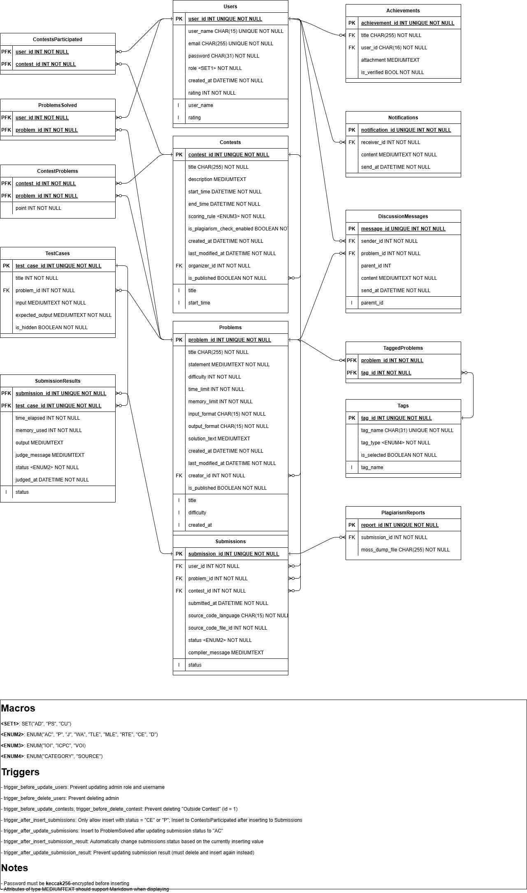

# Hướng dẫn sử dụng Online Judge Database

[TOC]

## Schema

**Tên CSDL**: OJDB.

**Lược đồ quan hệ**:

### Ý nghĩa các bảng

#### Users

- Hệ thống lưu thông tin của nhiều người dùng, gồm các thông tin liên quan đến auth như username, pasword, và các thông tin cá nhân hồ sơ khác như mật khẩu, vai trò (admin `AD`, người tạo bài tập `PS` hoặc người dùng thường `CU`).
- Người dùng có một điểm rating thể hiện thành tích trên hệ thống của bản thân; điểm này thay đổi khi làm các contest.
- Người dùng có thể tham gia các kỳ thi nhỏ (`ContestParticipated`), giải các bài tập (`ProblemSolved`). Người dùng có thể hiện thành tích của bản thân lên hồ sơ để flex (`Achievements`).
- Người dùng sẽ nhận được thông báo hệ thống (`Notifications`).
- Người dùng có thể tham gia thảo luận dưới các bài tập (`DiscussionMessages`)

#### Contests

- Hệ thống tổ chức các kỳ thi nhỏ để người dùng tham dự. Mỗi kỳ thi gồm có tên, mô tả kỳ thi, thời gian bắt đầu và kết thúc, cách chấm điểm, người tạo kỳ thi. Kỳ thi có thể áp dụng tính năng nhận diện gian lận hoặc không. Kỳ thi có thể được lưu lại dưới dạng draft trước khi publish.
- Cách chấm điểm của kỳ thi có thể là "IOI" hoặc "ICPC"
- Một kỳ thi gồm có nhiều bài tập. Một bài tập có thể nằm trong nhiều kỳ thi (`ContestProblems`)

#### Problems

- Hệ thống có nhiều bài tập để người dùng giải. Một bài tập gồm có tên, đề bài, độ khó (dưới dạng số), giới hạn thời gian chạy, giới hạn bộ nhớ sử dụng, phương pháp xuất/nhập, người tạo. Một số bài tập có thể có lời giải. Bài tập có thể được lưu lại dưới dạng draft trước khi publish.
- Các bài tập sẽ được gắn tag để dễ tìm (`TaggedProblems`)
- Một kỳ thi gồm có nhiều bài tập. Một bài tập có thể nằm trong nhiều kỳ thi (`ContestProblems`)

#### Submissions

- Người dùng phải nộp một lời giải để giải một bài tập. Lời giải này được một người nộp, nộp cho một bài tập và trong một contest (Nếu lời giải được nộp ngoài thời gian contest, nó sẽ được coi là không chính thức). Lời giải gồm có thời gian nộp, ngôn ngữ lập trình, mã nguồn (có thể lưu tại file bên ngoài), trạng thái bài nộp và thông tin từ chương trình dịch.
- Trạng thái bài nộp nhận một trong các giá trị:
  - `AC`: lời giải đã chấm xong và được chấp nhận
  - `P`: lời giải đang được đợi để chấm
  - `J`: lời giải đang được chấm
  - `WA`: lời giải đã chấm xong và không được chấp nhận vì có một test cho kết quả khác đáp án
  - `TLE`: lời giải đã chấm xong và không được chấp nhận vì có một test chạy quá thời gian cho phép của bài tập
  - `MLE`: lời giải đã chấm xong và không được chấp nhận vì có một test sử dụng quá bộ nhớ cho phép của bài tập
  - `RTE`: lời giải đã chấm xong và không được chấp nhận vì có một test mà chương trình trả về giá trị khác `0` (chạy sinh lỗi)
  - `CE`: lời giải không dịch được bởi chương trình dịch và sẽ không được chấm
  - `D`: lời giải bị từ chối chấm (có thể do người dùng đã bị ban hoặc có một dữ liệu nào đó không hợp lệ)
- CSDL chỉ cho phép chèn một lời giải mới với trạng thái là `P` hoặc `CE`. Để có các trạng thái khác, phải sử dụng phép cập nhật hoặc đợi cho việc chấm bài hoàn tất trên tất cả các test.
- Một lời giải sẽ được chạy qua nhiều test case để có kết quả chi tiết (`SubmissionResults`)
- Lời giải có thể bị quét bởi thuật toán kiểm tra gian lận (`PlagiarismReports`)

#### TestCases

- Một bài tập có nhiều test case. Mỗi test case gồm một đầu vào, một đầu ra mong đợi, và có thể bị ẩn khỏi người dùng thường.

#### SubmissionResults

- Một lời giải phải chạy qua nhiều test case để có kết quả. Một bộ kết quả gồm thời gian chạy, lượng bộ nhớ sử dụng, đầu ra, thông tin từ máy chấm, trạng thái kết quả và thời gian chấm
- Trạng thái kết quả có thể là một trong các giá trị đã liệt kê tại `Submissions`
- Nếu chèn một bộ kết quả có trạng thái là `WA`, `TLE`, `MLE`, `RTE`, trạng thái tại bảng `Submissions` sẽ tự động được cập nhật thành các giá trị này. Sau khi chèn, nếu toàn bộ các test thuộc về một bài tập đều cho trạng thái `AC`, trạng thái ở bảng `Submissions` cũng tự động được chuyển thành `AC`.
- Bảng `SubmissionResults` không cho phép cập nhật kết quả của một bộ đã được chèn.

#### ContestProblems

- Một kỳ thi gồm nhiều bài toán. Mỗi bài toán có một trọng số điểm riêng (không quan trọng nếu format của kỳ thi là ICPC)

#### Tags

- Hệ thống lưu lại các tag để dễ phân loại các bài tập. Một tag gồm có tên tag, loại tag (nguồn bài `SOURCE` hay loại bài `CATEGORY`).
- Bảng `Tags` có thêm một thuộc tính nữa là `is_selected` để chọn các tag khi cần lọc bài tập theo tag (do MySQL không cho phép các hàm hay thủ tục có đầu vào đa trị)

#### Achievements

- Người dùng có thể flex thành tích lên hồ sơ. Một thành tích gồm có tên, tài liệu đính kèm, và một "tick xanh"

#### Notifications

- Hệ thống gửi thông báo cho người dùng. Thông báo gồm có nội dung và thời điểm gửi

#### DiscussionMessages

- Người dùng có thể soạn tin nhắn thảo luận dưới các bài toán. Tin nhắn thảo luận gồm có nội dung, thời gian gửi và tin nhắn cha (có thể không có)

#### PlagiarismReports

- Cần nghiên cứu thêm (API cho bảng này cũng chưa có luôn)

## Sử dụng schema

### Online hosting MySQL server

Host: `mysql-3f37b883-ojdb-test.f.aivencloud.com`
Port: `11192`
User: `testuser`
Password: xem trên nhóm chat Messenger
Database: `ojdb`

### Cài đặt Schema (local)

Chưa có