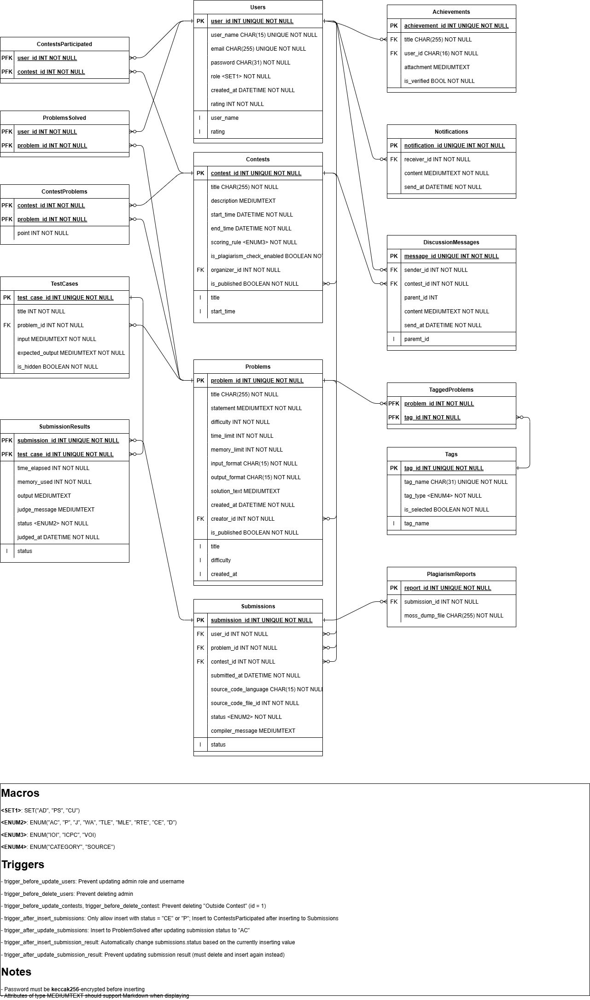

# Hướng dẫn sử dụng Online Judge Database

[TOC]

## Schema

Tên CSDL: OJDB.

Lược đồ quan hệ:



### Online hosting MySQL server

Hiện chưa có

### Cài đặt Schema (local)
Chạy `mysql` để vào MySQL, sau đó truy vấn

```sql
SOURCE ./src/services/init.sql
```

Để có dữ liệu mẫu, chạy tiếp truy vấn
```sql
SOURCE ./src/services/sampledata.sql
```

## Database API

Tất cả hàm và truy vấn trên dữ liệu được thực hiện thông qua đối tượng `db` thuộc lớp `Database`. Để sử dụng đối tượng này, cần có một file `.env` tại repo root directory có dạng

```
MYSQL_HOST="host"
MYSQL_USER="user"
MYSQL_PASSWORD="password"
MYSQL_DATABASE="ojdb"
```

### Constructor

```ts
constructor(
    __host: string,
    __user: string,
    __password: string,
    __database: string,
  )
```

Khởi tạo đối tượng thuộc lớp `Database`, trong đó mở kết nối tới database server. Kết nối được tạo ra là một connection pool kích thước bằng 10, sử dụng framework `mysql2`.

#### Tham số

- `__host`: Database host
- `__user`: Database user
- `__password`: Mật khẩu cho user
- `__database`: Tên database

#### Nhận xét

Khi import và gọi đối tượng `db`, nó đã được khởi tạo sẵn bằng hàm này với các tham số là các giá trị lưu trong `.env`. 

### Hàm `queryAddProblem`

```ts
async queryAddProblem(
    title: string,
    statement: string,
    difficulty: number,
    timeLimit: number,
    memoryLimit: number,
    inputFormat: string | null,
    outputFormat: string | null,
    solutionText: string | null,
    creatorId: number,
    isPublished: boolean | null = false,
  ): Promise<boolean>
```
Thêm một bài toán vào CSDL.

#### Tham số

- `title`: Tên của bài toán
- `statement`: Đề bài và các miêu tả khác của bài toán
- `difficulty`: Một số nguyên mô tả độ khó của bài toán
- `timeLimit`: Giới hạn thời gian cho các lần nộp bài, tính bằng millisecond. Khi nộp bài, nếu bài nộp có thời gian chạy một test vượt quá giá trị này thì trạng thái kết quả sẽ là `TLE` (Time Limit Exceeded)
- `memoryLimit`: Giới hạn bộ nhớ cho các lần nộp bài, tính bằng kilobyte. Khi nộp bài, nếu bài nộp có bộ nhớ sử dụng để chạy một test vượt quá giá trị này thì trạng thái kết quả sẽ là `MLE` (Memory Limit Exceeded)
- `inputFormat`: Một xâu miêu tả cách mà code của người dùng nhận dữ liệu, từ màn hình console (stdin) hay từ một file input. Để là `null` để sử dụng input từ màn hình console, hoặc để là tên file nếu muốn input từ file đó.
- `outputFormat`: Một xâu miêu tả cách mà code của người dùng xuất dữ liệu ra, ra màn hình console (stdout) hay ra một file input. Để là `null` để sử dụng input từ màn hình console, hoặc để là tên file nếu muốn input từ file đó.
- `solutionText`: Một xâu miêu tả lời giải cho bài toán. Lời giải này có thể được viết dưới dạng Markdown. Có thể để `null` nếu không có lời giải
- `creatorId`: `userId` của người tạo bài tập này
- `isPublished`: Giá trị boolean cho biết bài toán này đã được hoàn thiện để đăng lên chưa (dùng cho tính năng Save Draft). Để là `null` hoặc bỏ qua tham số này sẽ ngầm định `isPublished = 0`.

#### Giá trị trả về

Một `Promise`, khi hoàn thành sẽ trả về `true` nếu thành công. Nếu có lỗi, hàm này sẽ ném lại lỗi đó.

#### Nhận xét

Sử dụng hàm này để thêm một bài tập vào CSDL, chẳng hạn:

````ts
db.queryAddProblem(
        "A cộng B",
        'Cho $2$ số nguyên $A$ và $B$. Hãy tính $A + B$.

## Input

Gồm $1$ dòng chứa $2$ số nguyên $A$ và $B$ $(1\\leq A\\leq B \\leq 1000)$, cách nhau bởi $1$ dấu cách.

## Output

Ghi ra tổng $A + B$.

## Sample input

```
3 4
```

## Sample output

```
7
```',
        800,
        1000,
        512,
        null,
        null,
        '```
#include <iostream>

using namespace std;

int main() {
    int a, b;
    cin >> a >> b;
    cout << a + b;
    return 0;
}
```'
````

sẽ cho ra một bài toán có đề bài là "A cộng B", nhận dữ liệu từ màn hình console, xuất ra màn hình console, độ khó là 800, giới hạn thời gian 1s, giới hạn bộ nhớ 512KB, và có đề bài và lời giải trong code (thử copy phần trên ra Markdown để xem chi tiết).

Về ID của bài toán mới, nó sẽ được tự tính thông qua MySQL `AUTO_INCREMENT`.

### Hàm `queryInsertProblem`

```ts
async queryEditProblemAttr(
    problemId: number,
    title: string | null = null,
    statement: string | null = null,
    difficulty: number | null = null,
    timeLimit: number | null = null,
    memoryLimit: number | null = null,
    inputFormat: string | null = null,
    outputFormat: string | null = null,
    solutionText: string | null = null,
    creatorId: number | null = null,
    isPublished: boolean | null = null,
  ): Promise<boolean>
```

Sửa một bài tập đang có trong CSDL, biết trước `problemId` của bài tập và một số tham số khác.

#### Tham số

- `problemId`: ID của bài tập trong cơ sở dữ liệu. Lấy giá trị này thông qua [`queryFindProblems`](#hàm-queryfindproblems)
- Các tham số còn lại: Xem [`queryAddProblem`](#hàm-queryaddproblem). Đặt là `null` để giữ nguyên giá trị đã có

#### Giá trị trả về

Một `Promise`, khi hoàn thành sẽ trả về `true` nếu thành công. Nếu có lỗi, hàm này sẽ ném lại lỗi đó.

#### Nhận xét

Xem [`queryAddProblem`](#hàm-queryaddproblem)

### Hàm `queryDeleteProblem`

```ts
async queryDeleteProblem(problemId: number): Promise<boolean> 
```

Xoá một bài tập với ID cho trước đã có trong CSDL.

#### Tham số

- `problemId`: ID của bài tập trong cơ sở dữ liệu. Lấy giá trị này thông qua [`queryFindProblems`](#hàm-queryfindproblems)

#### Giá trị trả về

Một `Promise`, khi hoàn thành sẽ trả về `true` nếu thành công. Nếu có lỗi, hàm này sẽ ném lại lỗi đó.

#### Nhận xét

Nếu giá trị này không xuất hiện trong CSDL, không có gì xảy ra cả và hàm vẫn trả về `true` (do sử dụng `DELETE ... FROM ...`). Nếu xoá thành công, các bộ giá trị mang khoá ngoài tham chiếu đến giá trị này sẽ bị xoá (`ON DELETE CASCADE`).

### Hàm `queryGetProblemById` 

```ts
async queryGetProblemById(problemId: number): Promise<string>
```

Trả về tất cả thông tin có trong CSDL cho một bài tập với ID của bài tập đó.

#### Tham số

- `problemId`: ID của bài tập trong cơ sở dữ liệu. Lấy giá trị này thông qua [`queryFindProblems`](#hàm-queryfindproblems)

#### Giá trị trả về

Một `Promise`, khi hoàn thành sẽ trả về một xâu có dạng JSON chứa tất cả các entry có trong CSDL nếu thành công. Nếu có lỗi, hàm này sẽ ném lại lỗi đó.

#### Nhận xét


### Hàm `queryFindProblems` 

```ts
async queryFindProblems(
    problemId: number | null = null,
    title: string | null = null,
    difficultyLow: number | null = null,
    difficultyHigh: number | null = null,
    createdAtLow: string | null = null,
    createdAtHigh: string | null = null,
    creatorId: number | null = null,
    isPublished: boolean | null = null,
    limitRangeStart: number = 0,
    limitRangeSize: number = 50,
  ): Promise<string>
```

Lấy một số thông tin của một bài tập trong CSDL, dựa vào một số điều kiện cho trước. Kết quả được sắp xếp theo thời gian tạo của bài tập, từ mới đến cũ.

#### Tham số

- 8 tham số đầu: Xem [`queryAddProblem`](#hàm-queryaddproblem).
Có thể để là `null` để bỏ qua tìm kiếm. Để tất cả là `null` để liệt kê tất cả bài toán. 
- `limitRangeStart`, `limitRangeSize`: Các tham số phục vụ cho `LIMIT x, y` của MySQL.

#### Giá trị trả về

Một `Promise`, khi hoàn thành sẽ trả về một xâu có dạng JSON chứa `problem_id`, `title`, `difficulty`, `created_at`, `creator_id`, `is_published` có trong CSDL nếu thành công. Nếu có lỗi, hàm này sẽ ném lại lỗi đó.

#### Nhận xét

Hàm này chỉ trả về một lượng giới hạn các thuộc tính của các bài tập theo các điều kiện cho trước. Để lấy tất cả các thuộc tính, sử dụng hàm [`queryGetProblemById`](#hàm-querygetproblembyid).